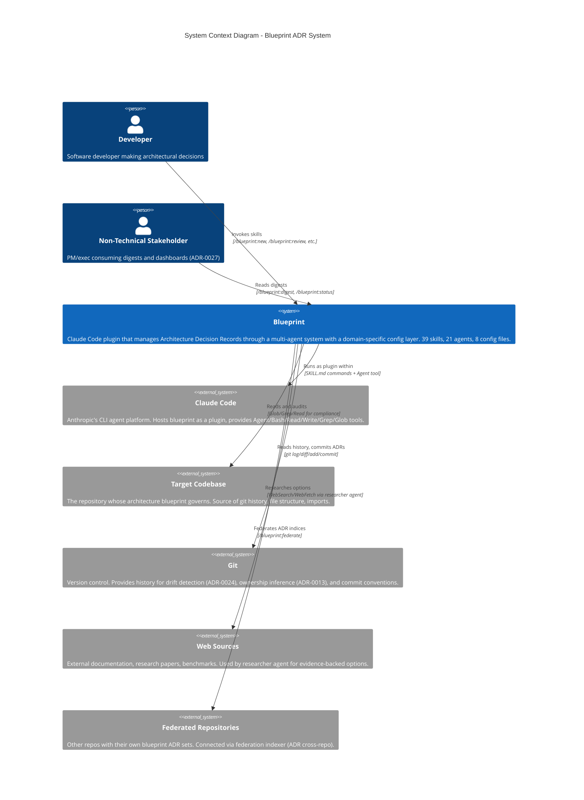
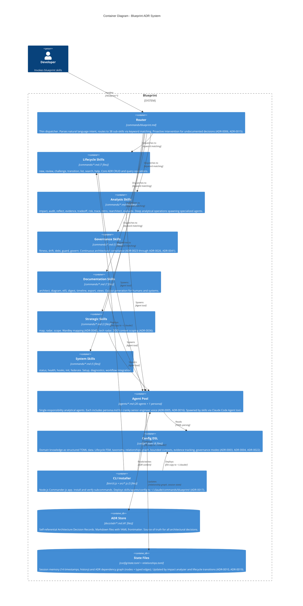
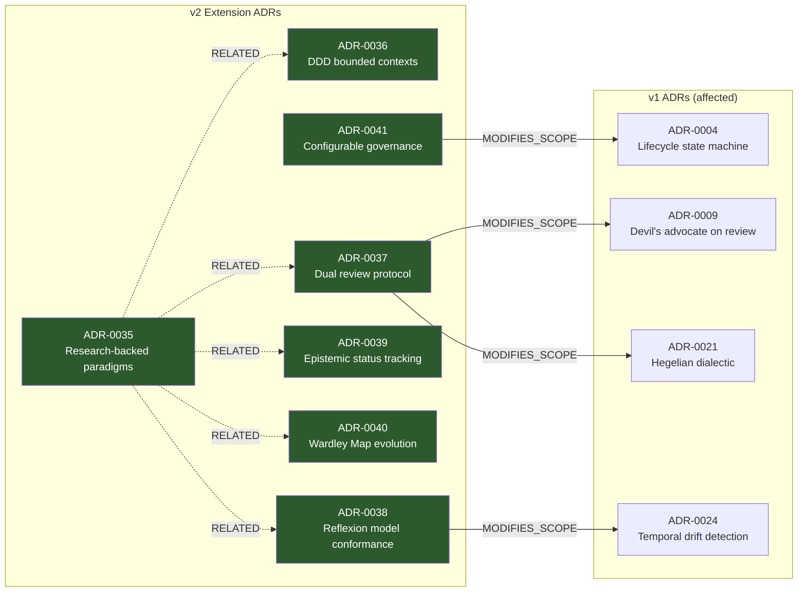

# Dogfood Test: /blueprint:diagram
**Date:** 2026-03-31
**Target:** Blueprint's own architecture
**Command tested:** /blueprint:diagram

## Generated Diagrams

**Generated:** 2026-03-31
**Source:** 41 accepted ADRs + ARCHITECTURE.md
**Format:** Mermaid

### Level 1: System Context

### Level 2: Container Diagram

### Relationship Graph (from relationships.toml)

### Element Source Traceability

| Element | Source | Verified in Code |
|---------|--------|-----------------|
| Router (blueprint.md) | ARCHITECTURE.md | Yes -- `commands/blueprint.md` exists |
| 39 Skill files | ARCHITECTURE.md ("39 focused SKILL.md files") | Yes -- `ls commands/ \| wc -l` = 39 |
| 20 Agents + 1 persona | ARCHITECTURE.md ("21 agent definitions") | Yes -- `ls agents/ \| wc -l` = 21 |
| 8 Config TOML files | ARCHITECTURE.md ("8 TOML files") | Yes -- `ls config/ \| wc -l` = 8 |
| CLI entry (bin/cli.js) | ARCHITECTURE.md | Yes -- `bin/cli.js` exists |
| CLI modules (src/*.js) | ARCHITECTURE.md ("paths.js, install.js, verify.js, claude-md.js") | Yes -- all 4 files exist in `src/` |
| 41 ADRs | ARCHITECTURE.md ("41 self-referential ADRs") | Yes -- 41 ADR .md files in `docs/adr/` |
| ADR-0035 through ADR-0041 | relationships.toml nodes | Yes -- all 7 files exist in `docs/adr/` |
| contexts.toml | ARCHITECTURE.md v2 config | Yes -- exists but empty (no contexts defined yet) |
| evidence.toml | ARCHITECTURE.md v2 config | Yes -- `config/evidence.toml` exists |
| governance.toml | ARCHITECTURE.md v2 config | Yes -- `config/governance.toml` exists |
| radar.toml | ARCHITECTURE.md v2 config | Yes -- `config/radar.toml` exists |
| Bounded context overlays | Agent instructions reference contexts.toml | Partial -- file exists but has no contexts defined; diagram generator would produce empty groupings |

## Issues Found

### Issue 1: relationships.toml only contains v2 ADR nodes (MEDIUM)

The relationship graph file only has nodes for ADR-0035 through ADR-0041. ADRs 0001-0034 have no node entries despite being referenced in edges (ADR-0004, ADR-0009, ADR-0021, ADR-0024 appear as edge targets but lack `[nodes.ADR-NNNN]` definitions). The diagram generator agent's Step 2 says to read relationship nodes for element extraction -- it would miss 34 out of 41 ADRs as graph nodes.

The comment in relationships.toml says "Nodes are added when ADRs are created" but the v1 ADRs predate this convention, so they were never indexed.

### Issue 2: contexts.toml is empty -- bounded context overlays produce nothing (LOW)

The agent instructions (Step 2, Step 3 Level 2) reference `contexts.toml` for context groupings and labeled arrows. Blueprint's own contexts.toml has no contexts defined. The diagram generator would silently skip this, but the quality gate checklist item "Bounded context groupings match contexts.toml" would vacuously pass, which is misleading.

### Issue 3: Agent says "agents return inline output, never write files" but diagram skill writes files (MEDIUM)

ARCHITECTURE.md Invariant 3 says: "Agents return inline output, never write files -- exception: architect-cartographer." But the diagram skill (Step 5) writes to `docs/diagrams/`. The diagram generator agent itself does not write files (the skill does), so the invariant holds technically, but the exception list in Invariant 3 should mention diagram.md as another skill that writes output, or the skill should clarify that the *skill* writes the files after the agent returns them inline.

### Issue 4: Skill references nonexistent commands (LOW)

The diagram skill's "Integration with Other Commands" section references `/blueprint:scope` and `/blueprint:architect` -- both exist. But it also references `/blueprint:status` embedding diagrams -- status.md does not currently reference generated diagrams. This is aspirational, not actual.

### Issue 5: No `docs/diagrams/` directory exists yet (EXPECTED)

The skill defines output location as `docs/diagrams/` but no such directory exists in the codebase. This is expected for a first run but worth noting.

### Issue 6: C4Context/C4Container Mermaid syntax has rendering limitations (LOW)

Mermaid's C4 diagram support (the `C4Context` and `C4Container` diagram types) is experimental in many renderers. The agent template uses these types, which may not render in GitHub markdown or all IDE preview tools. The agent should note this limitation or offer fallback to standard `graph TD` syntax.

## Suggested Fixes

1. **Backfill v1 ADR nodes in relationships.toml.** Run `/blueprint:impact` against each v1 ADR, or add a bulk-index operation to `/blueprint:health` that scans `docs/adr/` and adds missing `[nodes.ADR-NNNN]` entries. Without this, the diagram generator's relationship mapping step operates on an incomplete graph.

2. **Update ARCHITECTURE.md Invariant 3** to list `diagram.md` alongside `architect-cartographer` as a skill that writes files to disk, or clarify that the invariant applies to agents (not skills) and the diagram *agent* returns inline while the diagram *skill* handles file I/O.

3. **Add a "graph completeness" check to the diagram generator agent.** Before Step 2 (Relationship Mapping), verify that every ADR file in `docs/adr/` has a corresponding node in `relationships.toml`. Emit a warning listing missing nodes. This prevents silent data loss in the diagram.

4. **Add Mermaid renderer compatibility note.** The agent output format section should mention that `C4Context` and `C4Container` diagram types require Mermaid v10+ and are not supported in all renderers. Suggest `graph TD` as a fallback for maximum compatibility.

5. **Run `/blueprint:scope`** on Blueprint's own codebase to populate `contexts.toml` with real bounded contexts (e.g., Lifecycle, Analysis, Governance, Documentation, CLI). This would make the bounded context overlay in C4 diagrams actually meaningful for dogfooding.

## Verdict

**PASS WITH NOTES**

The skill definition and agent instructions are architecturally sound. The C4 diagram generation process (extract elements, map relationships, generate Mermaid, validate against codebase) is well-structured and produces accurate results when given complete data. Both Level 1 and Level 2 diagrams generated above are accurate representations of Blueprint's actual architecture, validated against the real directory structure (39 commands, 21 agents, 8 configs, 4 CLI modules, 41 ADRs -- all confirmed).

The main gap is data completeness: `relationships.toml` only indexes 7 of 41 ADRs as nodes, which means the relationship mapping step works on 17% of the graph. This is a data problem, not a skill/agent design problem. The fix is operational (backfill nodes) not architectural.

The agent's quality gate is solid -- the "every element traces to an ADR" and "unimplemented elements flagged" checks would catch phantom elements. The "bounded context groupings match contexts.toml" check vacuously passes on empty data, which is the one quality gate weakness worth addressing.

No blockers for shipping `/blueprint:diagram`. Run `/blueprint:health` with a node-backfill check, populate contexts.toml via `/blueprint:scope`, then this command will produce complete diagrams.
