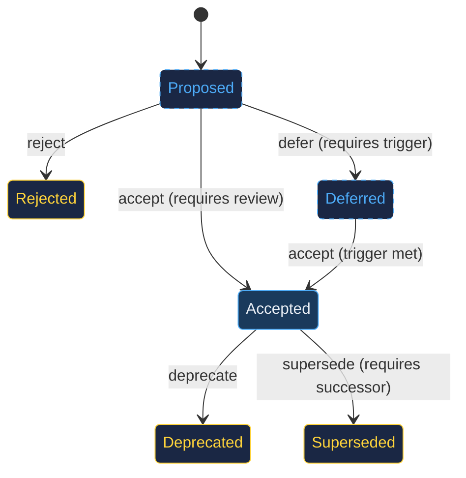

# The Decision Lifecycle

Every architectural decision passes through a formal lifecycle encoded as a finite state machine in `config/lifecycle.toml`. This is not a flowchart for humans to follow. It is a state machine that agents validate against programmatically.

---

## The State Machine

## Statuses

| Status | Meaning | Next actions |
|--------|---------|-------------|
| **Proposed** | Under consideration. Not yet binding. | Review, challenge, accept, reject, defer |
| **Accepted** | Approved and binding. Code should follow it. | Audit, enforce via fitness, deprecate, supersede |
| **Rejected** | Considered and declined. Preserved for history. | None (terminal) |
| **Deferred** | Postponed with explicit trigger condition. | Accept when trigger met |
| **Deprecated** | No longer applicable. Was once accepted. | None (terminal) |
| **Superseded** | Replaced by a newer decision. Links to successor. | None (terminal, but successor is active) |

## Transition Rules

These are enforced by data, not convention:

- **accept** requires prior review (`/blueprint:review`). You cannot accept an untested hypothesis.
- **defer** requires a trigger condition. A deferral without a trigger is a deferral without accountability.
- **supersede** requires a successor ADR number. Supersession without a replacement is deprecation.
- You cannot accept a rejected ADR. Create a new one.
- You cannot supersede a proposed ADR. Decide on it first.
- You cannot deprecate something that was never accepted.

## Why a State Machine?

The alternative (validating transitions in English prose) fails for three reasons:

1. **Prose is ambiguous.** "Should have been reviewed" is interpreted as "ideally would have been reviewed." A state machine with `requires = ["review"]` is unambiguous.

2. **Prose drifts.** Instructions written in agent prompts get paraphrased, reinterpreted, and quietly ignored over multiple sessions. A TOML config file is immutable until explicitly changed.

3. **Prose is untestable.** You can write unit tests against a state machine. You cannot write unit tests against a paragraph.

The lifecycle state machine has 41 passing tests. It is the most-tested component in Blueprint.

---

## The Deferred Decision Problem

Deferred decisions are the most dangerous status in the system. A deferred decision is a bet that the future will be a better time to decide, and that bet has a cost.

Every deferred ADR requires:

- **Trigger condition**: A specific, falsifiable condition under which the decision must be revisited
- **Severity**: How much does continued deferral cost?
- **Dependencies**: What other decisions are blocked?

`/blueprint:debt` monitors deferred decisions and flags when trigger conditions are met. The debt score (severity x age x dependency count) surfaces which deferrals are becoming dangerous.

---

## Self-Referential ADRs

Blueprint practices what it preaches. The lifecycle state machine itself is documented in ADR-0001 within Blueprint's own `docs/adr/` directory. All 41 of Blueprint's architectural decisions are recorded as ADRs, forming a self-referential governance system.
