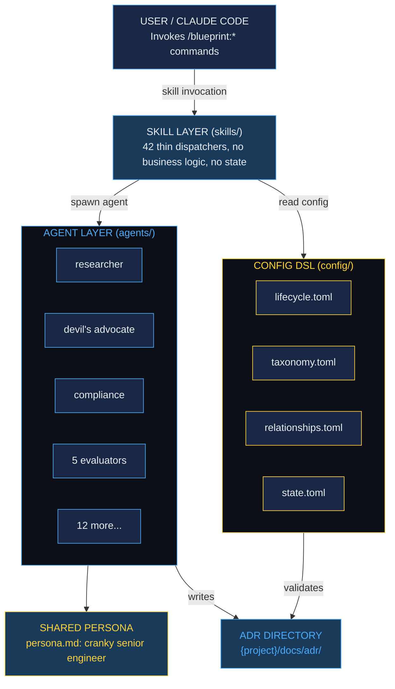

# Architecture

Blueprint is a Claude Code plugin that decomposes architectural governance into orthogonal concerns, each handled by a specialized agent, coordinated by thin skill dispatchers, and grounded in a TOML domain-specific language that encodes domain knowledge as data.

## At a Glance

| Dimension | Count |
|-----------|-------|
| Commands (skills) | 42 |
| Agents | 21 |
| Config files | 9 |
| Hooks | 10 |
| Self-referential ADRs | 41 |
| Architecture paradigms | 15 |

## Directory Structure

```
blueprint/
├── skills/                    42 skill files (CLI commands)
│   ├── blueprint.md           Thin router: detects intent, dispatches
│   ├── init.md                Bootstrap from codebase
│   ├── new.md                 ADR creation + research
│   ├── review.md              Devil's advocate flow
│   ├── evaluate.md            5-agent evaluation team
│   ├── audit.md               Compliance verification
│   ├── fitness.md             CI-runnable architecture tests
│   └── ...                    35 more focused skills
│
├── agents/                    21 agent definitions
│   ├── persona.md             Shared senior engineer personality
│   ├── adr-researcher.md      Evidence-backed option analysis
│   ├── adr-devils-advocate.md Adversarial challenge
│   ├── adr-compliance-auditor.md  Codebase verification
│   ├── adr-consistency-auditor.md Pattern adherence
│   ├── adr-bug-surface-mapper.md  Complexity cartography
│   ├── adr-maintainability-assessor.md  Long-term health
│   ├── adr-testing-strategy-evaluator.md  Pyramid & anti-patterns
│   ├── adr-conways-law-analyzer.md  Org-architecture alignment
│   └── ...                    11 more specialized agents
│
├── config/                    Domain-specific language (TOML)
│   ├── lifecycle.toml         Finite state machine
│   ├── taxonomy.toml          Classification system
│   ├── state.toml             Session memory
│   ├── relationships.toml     ADR dependency graph
│   ├── contexts.toml          DDD bounded contexts
│   ├── evidence.toml          Epistemic status tracking
│   ├── governance.toml        Governance mode
│   ├── radar.toml             Technology Radar
│   └── quickstart-templates.toml  Pre-built ADR stubs
│
├── hooks/                     10 automation hooks
│   └── hooks.json             Pre-built governance triggers
│
├── docs/                      Documentation + ADRs
│   ├── ARCHITECTURE.md        Bird's-eye codemap
│   └── adr/                   41 self-referential ADRs
│
├── src/                       CLI implementation
├── bin/                       Entry points
└── .claude-plugin/            Plugin registration
```

## The Three Layers



!!! warning "Skills are thin"
    Skills contain presentation logic and agent coordination. They do not contain business logic. Domain knowledge lives in config files. Analysis logic lives in agents. This separation means you can change *how decisions are classified* by editing `taxonomy.toml` without touching any agent or skill.

## Configuration Philosophy

Domain knowledge is encoded in config files, not agent prompts:

- **TOML** for system-wide domain knowledge (lifecycle state machine, taxonomy, relationships)
- **Per-project state** for project-specific data (ADR directory, last audit date, bounded contexts)

The experiment: if you change `taxonomy.toml` to add a new root cause category, every agent that classifies root causes will use it, without any prompt change. This is the payoff of encoding knowledge as data.

## Further Reading

- [The Decision Lifecycle](decision-lifecycle.md): The finite state machine in detail
- [Agent Architecture](agents.md): 21 agents, one persona, orthogonal responsibilities
- [Config DSL](config-dsl.md): The TOML domain-specific language
- [Five Dimensions of Health](five-dimensions.md): The evaluation framework
