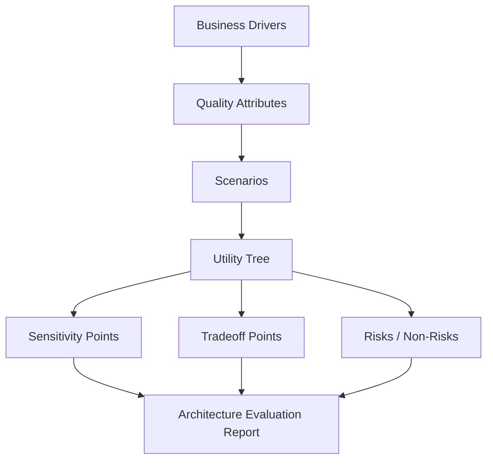
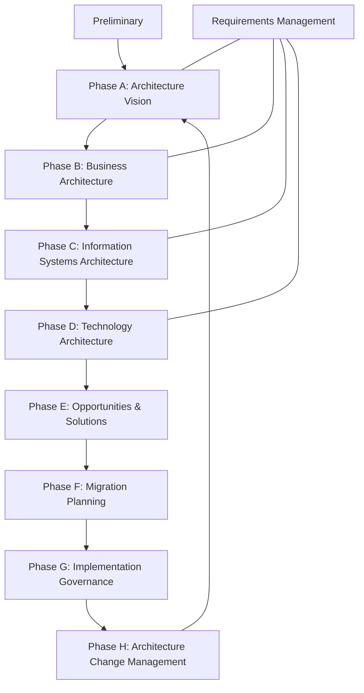
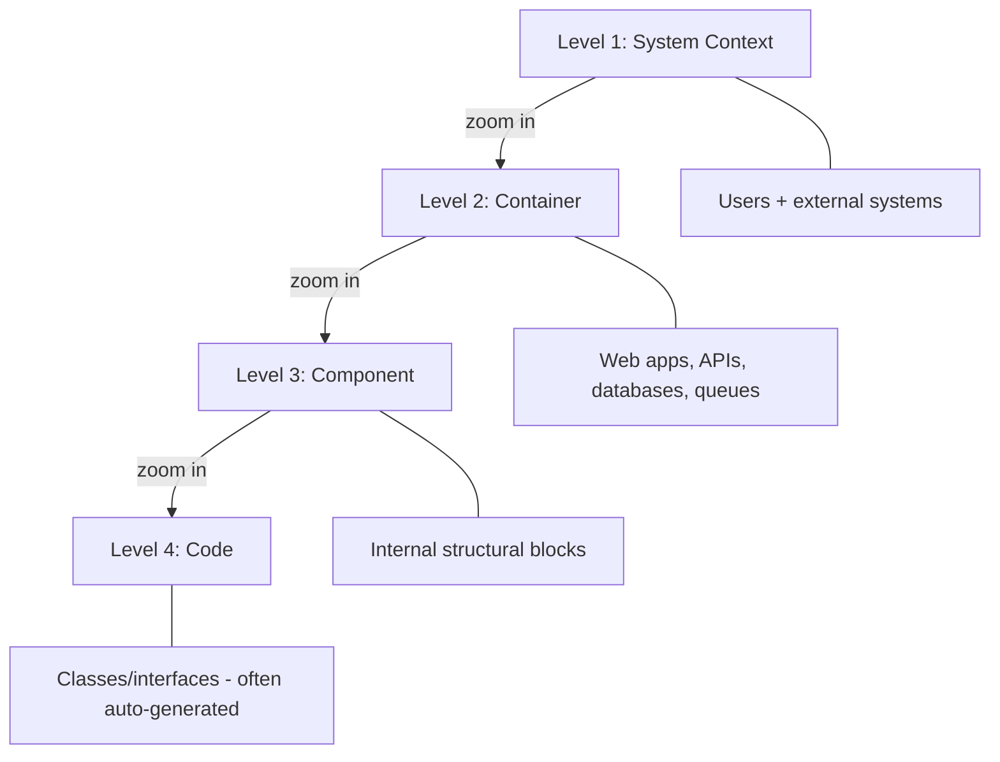
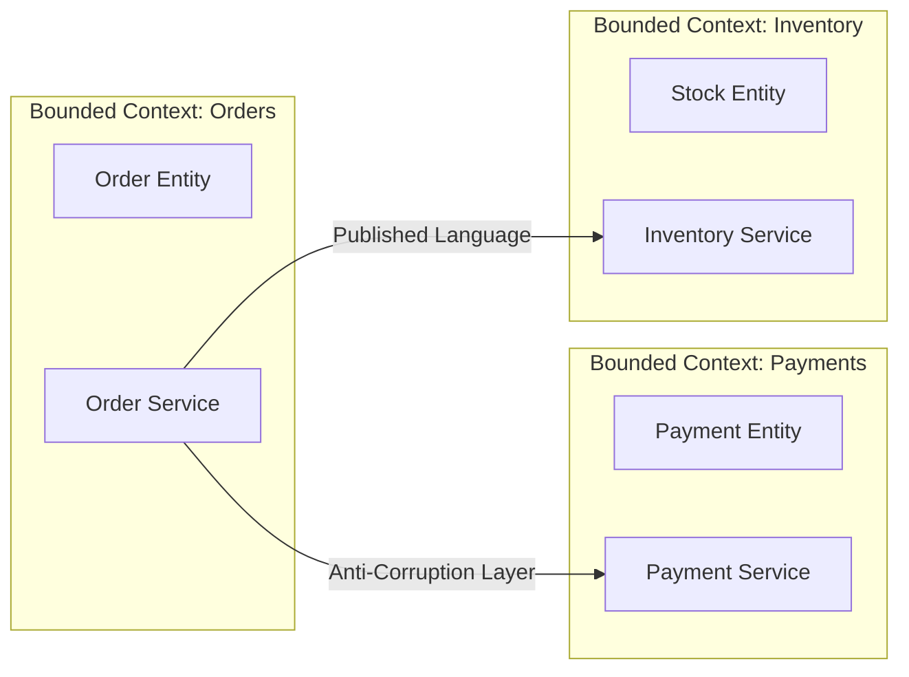
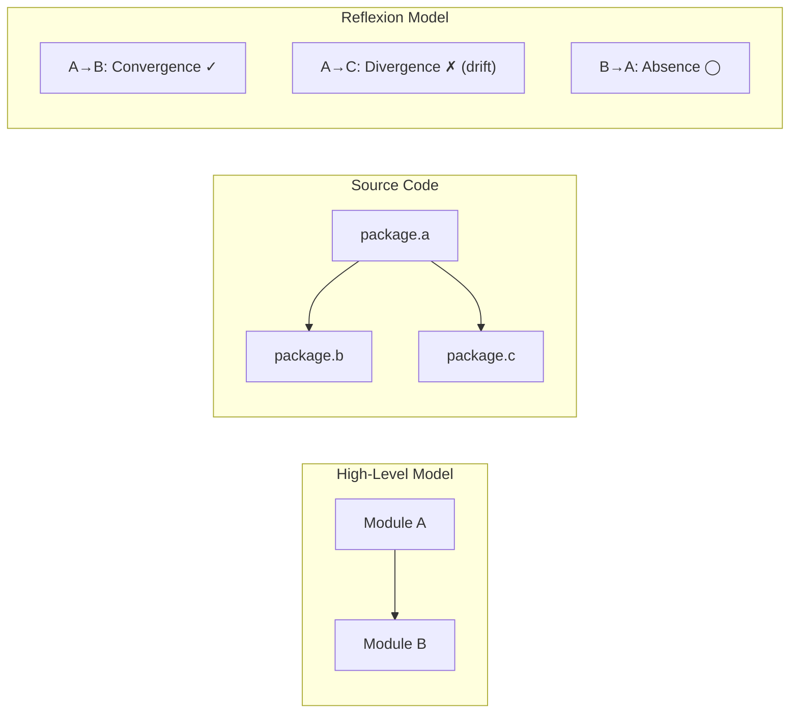
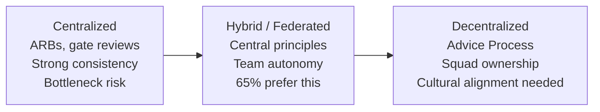
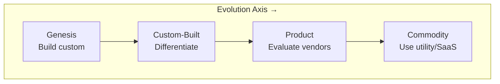
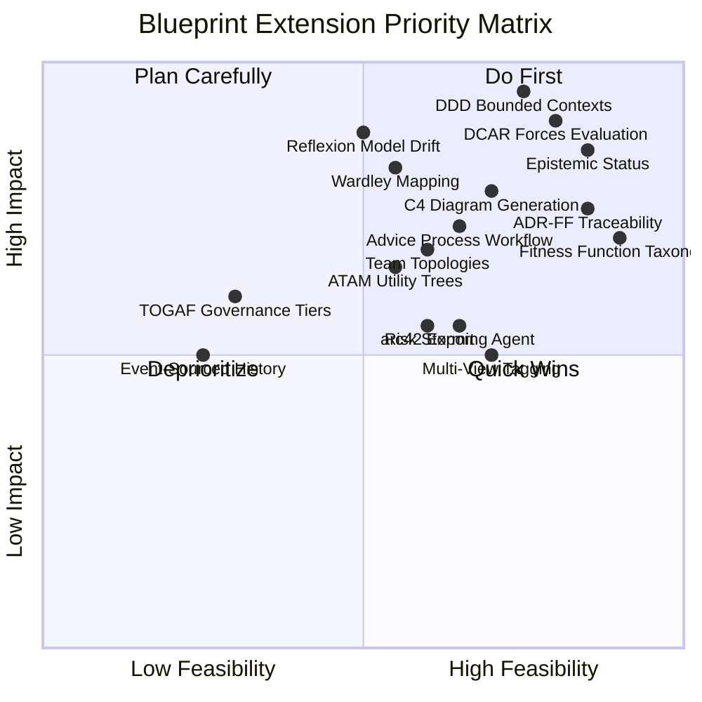
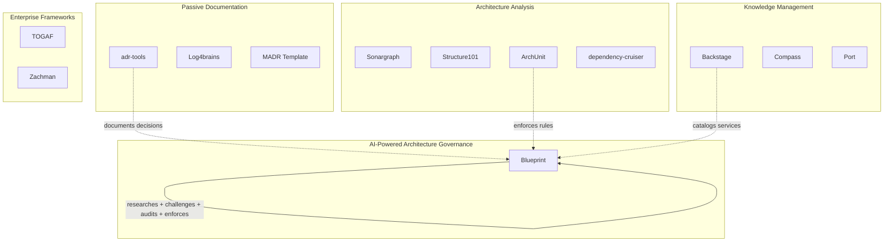

# Software Architecture Paradigms, Auditing, and Management: A Comprehensive Research Report

**Date:** 2026-03-30
**Prepared for:** Blueprint ADR System Extension Planning
**Sources consulted:** 86 unique sources across 4 research dimensions
**Scope:** Architecture evaluation methods, paradigms/frameworks, ADR ecosystem, governance models, emerging trends

---

## Executive Summary

Software architecture management has evolved from heavyweight, ceremony-laden processes (TOGAF, ATAM) toward lightweight, decision-centric, continuously enforced approaches. This report surveys the complete landscape — from foundational evaluation methods through modern paradigms to emerging AI-assisted governance — and identifies which methods would most extend Blueprint's capabilities.

**Three inflection points define the field:**

1. **The ADR revolution (2011):** Michael Nygard's Architecture Decision Records shifted architecture management from documentation-as-artifact to decisions-as-code, stored alongside the systems they govern.

2. **The fitness function paradigm (2017):** Neal Ford, Rebecca Parsons, and Patrick Kua's "Building Evolutionary Architectures" transformed architecture governance from periodic human review to continuous automated enforcement — decisions that verify themselves.

3. **The epistemic staleness crisis (2026):** A recent arXiv paper found that 23% of architectural decisions had stale evidence within two months, with 86% discovered reactively during incidents. AI-assisted architecture amplifies decision velocity beyond validation capacity.

**Blueprint's unique position:** No other tool combines ADR lifecycle management, AI-powered research/review/audit, drift detection, fitness function generation, and multi-dimensional architecture evaluation. Blueprint occupies a gap between passive ADR tools (adr-tools, Log4brains) and heavyweight analysis platforms (Sonargraph, Structure101). The extensions identified in this report would cement Blueprint as the industry's most complete architecture governance system.

**Top 5 extensions by impact:**

| Rank | Extension | Source Paradigm | Impact |
|------|-----------|----------------|--------|
| 1 | DDD bounded context scoping | Domain-Driven Design | Scopes ADRs to domains; enables per-team views |
| 2 | DCAR-style structured evaluation | Decision-Centric Architecture Reviews | Most natural formal method for ADR-based systems |
| 3 | Reflexion model drift detection | Murphy/Notkin/Sullivan (1995) | Transforms drift detection from heuristic to systematic |
| 4 | Epistemic status tracking | Koenig et al. (2026) | Addresses evidence staleness in AI-assisted decisions |
| 5 | Wardley Mapping integration | Simon Wardley | Strategic context for build/buy/commodity decisions |

---

## Part I: How Organizations Audit and Manage Software Architecture

### 1.1 ATAM — The Gold Standard for Architecture Evaluation

**Origin:** Software Engineering Institute (SEI), Carnegie Mellon University, 1998. Authors: Rick Kazman, Mark Klein, Paul Clements, Mario Barbacci.

ATAM remains the most widely cited and used formal architecture evaluation method. It is a 9-step, 2-phase process requiring 3-4 days with 12-15 participants. Its power comes from systematic identification of:

- **Sensitivity points** — architectural parameters where small changes have large quality effects
- **Tradeoff points** — parameters affecting multiple quality attributes simultaneously
- **Risks** — decisions that could cause problems under certain conditions
- **Non-risks** — decisions confirmed as architecturally sound

The process centers on a **quality attribute utility tree** — a structured decomposition of business drivers into quality attributes (performance, security, modifiability), each with concrete scenarios and priority rankings (High/Medium/Low for both importance and difficulty).

**Industry adoption:** High in defense, government, aerospace, and large enterprise. Lower in agile-native organizations due to ceremony overhead. ATAM's vocabulary (sensitivity points, tradeoffs, utility trees) has become standard architectural language even in organizations that never run formal ATAMs.

**Blueprint extension opportunity:** An ATAM-inspired evaluation agent could generate quality attribute utility trees from accepted ADRs, identify sensitivity points by analyzing cross-references, and detect tradeoff points by finding ADRs pulling in opposite quality directions. This brings ATAM's most valuable outputs without its heavyweight process.

### 1.2 SAAM — The Ancestor

**Origin:** SEI/CMU, 1994. The first documented software architecture analysis method, focused primarily on modifiability. SAAM pioneered scenario-based evaluation — the intellectual foundation for everything that followed. Rarely used in its original form today, having been superseded by ATAM.

### 1.3 DCAR — The Decision-Centric Bridge

**Origin:** Uwe van Heesch, Veli-Pekka Eloranta, Paris Avgeriou, Kai Koskimies, Neil Harrison. Published in IEEE Software, 2014.

DCAR is **the most important evaluation method for Blueprint's design philosophy** because it treats architectural decisions — not scenarios or quality attributes — as the primary unit of analysis. This directly aligns with ADR-based systems.

**Core process (7 steps):**

1. Present architecture overview
2. Identify key decisions
3. Prioritize decisions by importance and risk
4. Select top-priority decisions for review
5. Document each decision using a forces template (arguments for/against, alternatives, rationale)
6. Evaluate decisions (10 minutes each) — reviewers challenge using documented forces
7. Report results — decisions rated "confirmed" vs. "needs re-evaluation"

**The forces template** is DCAR's key innovation: each decision is documented with explicit arguments for and against, weighted by stakeholders. This maps directly to an ADR's Context/Decision/Consequences structure but adds systematic force-balancing.

**Blueprint extension opportunity (HIGH PRIORITY):** Blueprint's `/blueprint:review` currently uses a devil's advocate agent. Adding DCAR's structured forces evaluation would formalize the review process: weight arguments for/against, generate decision relationship views, and score decisions as confirmed vs. needs-re-evaluation. This is Blueprint's most natural formal method counterpart.

### 1.4 Architecture Review Boards

**Origin:** Formalized in TOGAF (Chapter 23/44); practice predates the framework.

ARBs are ubiquitous in large enterprises — virtually every Fortune 500 company has some form. However, the State of DevOps Report reveals that traditional ARBs correlate with *low* organizational performance. They become bottlenecks that slow delivery and create adversarial relationships.

**Modern evolution:** AWS and cloud-native organizations recommend augmenting ARBs with AI-automated pre-review against enterprise standards before human board review. Blueprint could generate ARB submission packages from proposed ADRs.

### 1.5 Architecture Fitness Functions — The Automation Revolution

**Origin:** Neal Ford, Rebecca Parsons, Patrick Kua. "Building Evolutionary Architectures," O'Reilly, 2017 (2nd ed. 2023).

Fitness functions are **the most important modern innovation in architecture governance**. They transform architecture evaluation from periodic human activity to continuous automated enforcement.

**Definition:** "An objective integrity assessment of some architectural characteristic(s)" — executable checks that verify architectural decisions are being followed.

**Taxonomy:**

| Dimension | Type A | Type B |
|-----------|--------|--------|
| Scope | Atomic (single attribute) | Holistic (multiple attributes) |
| Cadence | Triggered (on commit/deploy) | Continual (always monitoring) |
| Result | Static (pass/fail) | Dynamic (context-adaptive thresholds) |
| Execution | Automated (CI pipeline) | Manual (human verification) |

**The critical bridge:** "A decision record documents the decision. A fitness function *assures* the decision." Most teams only do the first. Organizations report architecture violation rates dropping from 34 per year to 3 after implementing fitness functions in CI.

**Implementation ecosystem:**

| Tool | Ecosystem | Purpose |
|------|-----------|---------|
| ArchUnit | Java/Kotlin | Package dependencies, layering, naming, cycles |
| NetArchTest | .NET | Architecture rule assertions in unit tests |
| dependency-cruiser | JS/TS | Import rules, circular dependencies, layer enforcement |
| Pyarchtest | Python | Architecture testing |

**Blueprint already implements this** via `/blueprint:fitness` and `/blueprint:guard`. Extension opportunities: categorize fitness functions by the Ford/Parsons taxonomy, add holistic fitness functions checking multiple ADRs together, support dynamic functions with adaptive thresholds, and maintain a traceability matrix showing which ADR each fitness function enforces.

### 1.6 ISO/IEC 42010 — The International Standard

**Lineage:** IEEE 1471:2000 → ISO/IEC 42010:2007 → ISO/IEC/IEEE 42010:2011 → ISO/IEC/IEEE 42010:2022.

The standard establishes the conceptual framework for architecture description through **viewpoints**, **views**, **concerns**, and **stakeholders**. Its 2022 edition explicitly incorporates architecture decision capture.

**Key insight for Blueprint:** ISO 42010's viewpoint/concern/stakeholder model could power a gap-analysis tool identifying architectural concerns not yet covered by any ADR. A `/blueprint:describe` command could verify that all identified stakeholder concerns have at least one ADR addressing them.

### 1.7 Lightweight Approaches

**Risk Storming (Simon Brown, ~2015):** A 30-60 minute collaborative technique where participants independently identify risks on sticky notes, then place them on architecture diagrams to reveal risk concentrations. Blueprint could automate this by analyzing ADR coverage gaps across components.

**Architecture Katas (Ted Neward, ~2010):** Training exercises for developing architecture evaluation skills. Small groups design solutions to fictional RFPs and present to each other for cross-critique. Not an evaluation method per se, but the critique format mirrors DCAR's decision challenge process.

---

## Part II: Architecture Paradigms and Schools of Thought

### 2.1 TOGAF — Enterprise Architecture Framework

**Origin:** The Open Group, 1995 (based on US DoD TAFIM). Claims adoption by 80% of Global 50, 60% of Fortune 500.

TOGAF provides a comprehensive enterprise architecture framework centered on the **Architecture Development Method (ADM)** — a 10-phase iterative cycle:

**Strengths:** Comprehensive governance, well-defined stakeholder management, strong metamodel for business-technology traceability.

**Weaknesses:** Criticized as theory-focused with few practical worked examples. Most successful TOGAF implementations rarely follow prescriptions literally. Heavyweight and expensive to implement fully.

**Blueprint extension opportunity:** TOGAF's governance board concept and Architecture Repository could inform optional governance tiers in Blueprint — configurable modes from "lightweight" (current) to "governed" (N approvals required) to "formal" (phase-based gate reviews).

### 2.2 Zachman Framework — The Taxonomy

**Origin:** John Zachman, IBM, 1987. The original enterprise architecture classification system.

A 6×6 matrix crossing six interrogatives (What, How, Where, Who, When, Why) with six stakeholder perspectives (Planner through Functioning Enterprise). Comprehensive but static, with no methodology or process guidance. Declining in active use.

**Blueprint insight:** Zachman's interrogatives could inform a structured decision template — ensuring ADRs address all relevant dimensions when applicable.

### 2.3 C4 Model — Architecture Visualization

**Origin:** Simon Brown, developed 2006-2011.

The C4 model addresses the gap between complex UML and informal whiteboard sketches through four progressive zoom levels:

**Adoption:** ~50% of development teams use C4 for stakeholder communication, with reported 30% clarity improvement. Structurizr DSL enables version-controlled, automatable architecture models.

**Blueprint extension opportunity (HIGH PRIORITY):** Blueprint already has the ADR relationship graph data needed to auto-generate C4 System Context and Container diagrams. Each ADR accepting a system/service/database creates a C4 element. A `/blueprint:diagram` command could output Structurizr DSL or Mermaid, producing auto-updated diagrams that stay in sync with decisions.

### 2.4 arc42 — Pragmatic Documentation Template

**Origin:** Dr. Gernot Starke and Dr. Peter Hruschka, 2005.

A 12-section architecture documentation template that is intentionally minimal — every section is optional. Its most important connection to Blueprint: **Section 9 is literally "Architecture Decisions"** and Section 10 is "Quality Requirements" (fitness function targets).

**Blueprint extension opportunity:** A `/blueprint:export arc42` command mapping Blueprint's ADR collection into arc42's 12-section structure. ADRs populate Section 9; ARCHITECTURE.md populates Sections 3-7; fitness functions map to Section 10; risk assessments from retrospectives populate Section 11.

### 2.5 4+1 View Model

**Origin:** Philippe Kruchten, 1995 (IEEE Software). Foundational — influenced RUP, UML, C4, and ISO 42010.

Five concurrent views: Logical (end users), Development (developers), Process (system engineers), Physical (operations), and Scenarios (+1, all stakeholders). The "+1" validates the other four by walking through concrete use cases.

**Blueprint extension opportunity:** ADRs could be tagged with which view(s) they affect, enabling stakeholder-appropriate filtering — developers see development-view ADRs, operations sees physical-view ADRs.

### 2.6 Domain-Driven Design — The Most Impactful Extension Paradigm

**Origin:** Eric Evans, 2003. "Domain-Driven Design: Tackling Complexity in the Heart of Software."

DDD is **the paradigm that would cause the greatest extension to Blueprint's design** because its core concept — bounded contexts — addresses Blueprint's most significant architectural limitation: ADRs are currently global with no scoping mechanism.

**Strategic Design concepts:**

- **Bounded Context:** An explicit boundary within which a domain model and its ubiquitous language applies. Different contexts may have different models for the same real-world concept.
- **Context Map:** A visualization of relationships between bounded contexts using integration patterns (Customer-Supplier, Open Host Service, Anti-Corruption Layer, Shared Kernel, Conformist, Separate Ways, Partnership).
- **Ubiquitous Language:** Shared vocabulary used in code, conversations, and documentation — language boundaries align with context boundaries.

**Why DDD is the #1 extension for Blueprint:**

1. **ADR scoping:** A `context:` metadata field enables per-domain ADR views. In a system with 50 ADRs across 5 bounded contexts, each team sees only the 10 that govern their domain.
2. **Impact analysis:** `/blueprint:impact` would respect context boundaries — a change in the Orders context doesn't trigger review of Inventory ADRs unless there's a context map relationship.
3. **Context map as ADR relationship overlay:** The relationship graph between ADRs already exists; adding context mapping patterns (Customer-Supplier, ACL) enriches it with DDD vocabulary.
4. **Anti-corruption layers are ADR-worthy decisions:** Every integration pattern between contexts deserves documentation — DDD makes this explicit.

### 2.7 Hexagonal / Clean Architecture

**Origin:** Hexagonal (Alistair Cockburn, 2005), Onion (Jeffrey Palermo, 2008), Clean (Robert C. Martin, 2012).

The family shares a core principle: **business logic must be isolated from external concerns, with dependencies pointing inward**. The application core defines ports (interfaces); external adapters implement them.

**Blueprint extension opportunity:** Detect hexagonal/clean architecture adoption in a codebase and auto-generate dependency-direction fitness functions (no import from outer to inner layer). Pattern-aware fitness functions would have higher signal-to-noise than generic ones.

### 2.8 Evolutionary Architecture — Blueprint's Closest Intellectual Neighbor

**Origin:** Neal Ford, Rebecca Parsons, Patrick Kua (ThoughtWorks), 2017. Second edition 2023 subtitled "Automated Software Governance."

The core insight: architecture evolves whether you want it to or not. Rather than designing perfect architecture upfront, provide **fitness functions** that ensure incremental changes preserve important characteristics while allowing the architecture to evolve.

Blueprint already implements this philosophy via `/blueprint:fitness`, `/blueprint:drift`, and `/blueprint:guard`. The extension opportunity lies in:
- Categorizing fitness functions per the Ford/Parsons taxonomy
- Adding holistic fitness functions that check multiple ADRs together
- Supporting dynamic fitness functions with context-adaptive thresholds
- Tracking fitness function pass/fail rates as drift indicators

### 2.9 Cell-Based Architecture

**Origin:** Asanka Abeysinghe, Paul Fremantle (WSO2), ~2018. Adopted by AWS Well-Architected.

Groups related microservices, data stores, and infrastructure into independently deployable **cells**, each with a gateway as its single access point. Addresses the gap between individual microservices and monolithic enterprise layers.

**Blueprint insight:** Cells could serve as ADR scope boundaries — decisions within a cell vs. cross-cell decisions requiring inter-cell review.

### 2.10 Event-Driven Architecture / CQRS / Event Sourcing

**Origin:** Distributed systems research (1990s-2000s); CQRS and Event Sourcing formalized by Greg Young (~2010), building on Bertrand Meyer's Command-Query Separation (1988).

Martin Fowler identifies four EDA patterns: Event Notification, Event-Carried State Transfer, Event Sourcing, and CQRS. Each has distinct tradeoff profiles.

**Blueprint insight:** Event sourcing is structurally analogous to ADR management — both maintain append-only logs from which current state can be derived. Blueprint's ADR lifecycle (Proposed → Accepted → Deprecated → Superseded) parallels event sourcing's state derivation from event sequences. An event-sourced ADR history could enable temporal queries ("what did the architecture look like on date X?").

### 2.11 ARCHITECTURE.md (matklad)

**Origin:** Aleksey Kladov (matklad), February 2021.

New contributors spend ~2x longer writing patches due to unfamiliarity, but **10x longer discovering where changes should occur**. An ARCHITECTURE.md externalizes the experienced maintainer's mental map, addressing the larger multiplier.

**Blueprint status:** Already implemented via `/blueprint:architect`. The codemap, invariants, and boundaries are derived from ADR content. ARCHITECTURE.md describes **what is**; ADRs describe **why it is that way** — complementary, not competing.

---

## Part III: Architecture Decision Records — The Foundation

### 3.1 The Origin: Nygard (2011)

Michael Nygard published "Documenting Architecture Decisions" on November 15, 2011. The original format:

| Section | Purpose |
|---------|---------|
| Title | Short noun phrase (e.g., "ADR 1: Deployment on Ruby on Rails 3.0.10") |
| Status | Proposed, Accepted, Deprecated, or Superseded |
| Context | Forces at play — technological, political, social, project-local |
| Decision | Active-voice statement beginning with "We will..." |
| Consequences | All outcomes — positive, negative, and neutral |

Key philosophical principles: documents should be 1-2 pages, written in full paragraphs (not bullet points), stored in version control alongside code, and written as "a conversation with a future developer."

### 3.2 ADR Variants

**MADR (Markdown Any Decision Records):** Evolved from Nygard's template. Adds explicit "Considered Options" and "Pros and Cons" sections. Renamed from "Markdown Architectural Decision Records" to reflect broader applicability.

**Y-Statements (Olaf Zimmermann, SATURN 2012):** A single structured sentence capturing the complete decision:

> In the context of **[requirement]**, facing **[quality concern]**, we decided for **[outcome]** and neglected **[alternatives]**, to achieve **[benefits]**, accepting that **[drawbacks]**.

Forces completeness but creates long, difficult-to-read sentences.

**Lightweight ADRs (ThoughtWorks):** Placed in the Technology Radar **Adopt** ring in 2017. Martin Fowler's guidance adds confidence levels and reevaluation triggers. Andrew Harmel-Law's "Scaling Architecture Conversationally" adds the Architecture Advice Process — anyone can make architectural decisions after consulting affected parties and experts.

### 3.3 ADR Criticisms and Limitations

| Criticism | Severity |
|-----------|----------|
| **No enforcement** — documents intent but provides no compliance mechanism | Critical |
| **Scope creep** — without clear "architectural" definition, teams dump all decisions | High |
| **Knowledge loss** — most decisions happen verbally; writing them is an extra step teams skip | High |
| **Adoption friction** — consistency is the biggest challenge without enforcement | High |
| **Stale ADRs** — without lifecycle management, accepted ADRs become outdated | High |
| **Storage mismatch** — repo-stored ADRs fail for cross-ecosystem decisions | Medium |

**Blueprint addresses the critical gap (enforcement)** through fitness functions, compliance auditing, drift detection, and pre-commit guards. No other ADR tool does this.

### 3.4 ADR Tooling Landscape

| Tool | Type | Unique Feature |
|------|------|---------------|
| adr-tools | Bash CLI | Lightweight, widely adopted |
| Log4brains | CLI + Web | Searchable website, decision graphs |
| MADR | Template | Section-oriented standard |
| pyadr | Python | Lifecycle management |
| Structurizr | Java | Architecture visualization + decision logs |
| **Blueprint** | **AI-powered** | **Research, review, audit, fitness, drift — full lifecycle** |

**Blueprint's differentiator:** It is the only tool that treats ADRs as *living hypotheses* with a complete lifecycle — researched, challenged, accepted, audited, enforced, and revisited. Every other tool stops at documentation.

---

## Part IV: Architectural Drift and Technical Debt

### 4.1 Drift vs. Erosion

These are distinct concepts requiring different detection methods:

| Concept | Definition | Example |
|---------|------------|---------|
| **Drift** | Unplanned additions not violating the architecture | Adding an unplanned caching layer |
| **Erosion** | Decisions directly violating prescriptive architecture | Bypassing the service layer for direct DB calls |

Drift is additive (new things appear); erosion is subversive (existing rules get violated). Drift can eventually lead to erosion if unmanaged.

### 4.2 Reflexion Models — The Theoretical Foundation

**Origin:** Murphy, Notkin, Sullivan, 1995 (ACM SIGSOFT).

The most rigorous theoretical framework for architecture conformance checking:

1. Engineer defines a **high-level model** (intended architecture)
2. Engineer specifies a **mapping** from source entities to model elements
3. Tool computes a **reflexion model** showing:
   - **Convergences** — source matches the model
   - **Divergences** — source has dependencies the model doesn't specify (drift)
   - **Absences** — model specifies dependencies the source doesn't have

**Blueprint extension opportunity (HIGH PRIORITY):** Blueprint's drift detection currently uses git history trajectory analysis. Adding formal reflexion model comparison — generating the high-level model from accepted ADRs + ARCHITECTURE.md, computing mappings to source entities, and producing convergence/divergence/absence reports — would transform drift detection from heuristic to systematic.

### 4.3 Architecture Conformance Tools

| Tool | Approach | Key Strength |
|------|----------|-------------|
| Sonargraph | DSL-based rules, visualization | Most detailed dependency analysis |
| Structure101 | Visual architecture definition | Interactive exploration |
| jQAssistant | Neo4j graph database + Cypher queries | Any structural question expressible |
| Lattix | Dependency Structure Matrix | Good visualization |
| CodeScene | Behavioral code analysis from git history | Social/organizational patterns |

### 4.4 Conway's Law and Organizational Drift

**Conway's Law (Melvin Conway, 1967):** "Organizations which design systems are constrained to produce designs which are copies of the communication structures of these organizations."

Team structure changes are **leading indicators** of architectural drift. When teams restructure, the casual conversations that might have prevented architectural drift never happen. Blueprint's existing Conway's Law analyzer should be enhanced with Team Topologies vocabulary and treated as an early-warning system for drift.

### 4.5 Technical Debt

**Ward Cunningham's metaphor (1992):** Two cost components — principal (work to fix) and interest (ongoing overhead from the debt's presence).

**Fowler's Technical Debt Quadrant:**

|  | Reckless | Prudent |
|--|----------|---------|
| **Deliberate** | "We don't have time for design" | "We must ship now and deal with consequences" |
| **Inadvertent** | "What's layering?" | "Now we know how we should have done it" |

Blueprint's `/blueprint:debt` tracks deferred ADRs with trigger conditions. Extension opportunity: estimate "interest" accruing on deferred decisions based on codebase changes in the affected area, making decision debt visible in business terms.

---

## Part V: Architecture Governance Models

### 5.1 The Governance Spectrum

**Market data:** ~65% of technical leaders prefer hybrid or federated governance (29% hybrid, 36% federated), with only 36% preferring purely centralized approaches. Federated models with automated enforcement cut incidents by 50%.

### 5.2 The Architecture Advice Process — The Most Significant Governance Innovation

**Origin:** Andrew Harmel-Law, documented on Martin Fowler's site. ThoughtWorks Technology Radar: **Trial** (April 2025).

> **The Rule:** Anyone can make an architectural decision.
> **The Constraint:** Before deciding, seek advice from (a) those meaningfully affected and (b) those with relevant expertise.

Supporting elements:
- **ADRs** with an "advice" section capturing all counsel received
- **Architecture Advisory Forum** — weekly 1-hour gathering for discussing proposed decisions
- **Team-sourced architectural principles** (SMART criteria)
- **Internal Technology Radar**

This model explicitly replaces gatekeeping with expertise-sharing and approval with conversation. It addresses the most common ADR criticism — that decisions happen verbally and get lost.

**Blueprint extension opportunity:** A `/blueprint:advise` workflow that records who was consulted, what advice was given, and how it influenced the decision — embedded in ADR metadata. This would make Blueprint the first tool to implement the Architecture Advice Process digitally.

### 5.3 Governance Anti-Patterns

| Anti-Pattern | Description | Detection Signal |
|---|---|---|
| **Ivory Tower** | Architects disconnected from code | ADRs nobody references |
| **Rubber Stamp** | Committee that approves everything | 100% approval rate |
| **Governance Theater** | Documentation for optics | Packages for minimal-risk changes |
| **Architecture by Committee** | Decisions averaged across too many stakeholders | Bland compromise decisions |

Root cause: governance designed for oversight optics rather than architectural function. The fix is structural change, not policy change.

### 5.4 Agile Architecture Governance

**SAFe Architectural Runway:** Provides "just enough" architecture at the lowest scaling level. Architect as enabler, not governor.

**Continuous Architecture (Erder & Pureur):** Six principles treating architecture as an ongoing activity:

1. Architect products, not just solutions for projects
2. Focus on quality attributes, not functional requirements
3. Delay design decisions until absolutely necessary
4. Architect for change — leverage "the power of small"
5. Architect for build, test, and deploy
6. Model the organization after the design of the system

**Blueprint extension opportunity:** These principles could serve as evaluation criteria in `/blueprint:review` — "Is this decision being made too early? (Principle 3)" or "Does this ADR focus on functional requirements rather than quality attributes? (Principle 2)".

---

## Part VI: Emerging Trends

### 6.1 AI-Assisted Architecture

**Current state (2026):** 1.3M+ repositories using AI code review integrations (4x from 2024). 47% of professional developers have used AI-assisted review. Repositories with AI review show 32% faster merges and 28% fewer post-merge defects.

**Critical challenge — Epistemic Staleness:** A 2026 arXiv paper (Koenig et al.) found:
- ~23% of architectural decisions had stale evidence within two months
- 86% of staleness discovered reactively during incidents, not proactively
- Decisions are made faster than they can be validated

**Proposed framework:**
- **Epistemic layers:** L0 (unverified), L1 (logically consistent), L2 (empirically validated)
- **Conservative aggregation:** Decision confidence = minimum evidence confidence
- **Temporal validity tracking:** Explicit evidence expiry windows

**Blueprint extension opportunity (HIGH PRIORITY):** ADR fields for `Evidence Validity: [L0|L1|L2]` and `Evidence Expires: YYYY-MM-DD`. `/blueprint:debt` enhanced to surface decisions with expired evidence. This directly addresses a documented gap in AI-assisted architecture governance.

### 6.2 Team Topologies

**Origin:** Matthew Skelton and Manuel Pais, 2019.

Four team types: Stream-aligned, Platform, Enabling, Complicated-subsystem. Three interaction modes: Collaboration, X-as-a-Service, Facilitating.

**Susanne Kaiser's integration (Architecture for Flow):** Combines Wardley Mapping + DDD + Team Topologies — arguably the most complete modern framework for architecture-organization alignment.

**Blueprint extension opportunity:** Extend the existing Conway's Law analyzer with Team Topologies vocabulary. ADR field: `Team Topology Impact: [which team types affected, interaction mode changes]`. Evaluation checks: "This decision creates a coupling between two stream-aligned teams. Consider an X-as-a-service interaction via a platform team."

### 6.3 Wardley Mapping

**Origin:** Simon Wardley. Maps components along two axes: value chain (visibility to user) and evolution (Genesis → Custom-built → Product → Commodity).

**Architecture decision value:** Answers "should we build, buy, or use a commodity?" based on where a component sits on the evolution axis. A custom authentication system in 2026 is building for a commodity — the Wardley map makes this visible.

**Blueprint extension opportunity:** ADR template field `Evolution Stage: [genesis|custom|product|commodity]`. Devil's advocate agent checks: "You're building custom for a commodity component. Why?" Drift detection: alert when a component has evolved past its ADR's assumed stage.

### 6.4 Platform Engineering and Golden Paths

**Origin:** Spotify's Golden Paths, adopted by Google and Netflix.

Golden paths encode architectural decisions as executable defaults. Security, observability, and cost management become platform features rather than per-team responsibilities. Teams *can* deviate, but the default path embodies the architecture.

**Blueprint insight:** Fitness functions and golden paths serve the same purpose from different angles — fitness functions enforce constraints (negative: "don't do this"), while golden paths provide defaults (positive: "do it this way"). Blueprint could generate golden path documentation from accepted ADRs.

### 6.5 Architecture Observability

Architecture fitness functions have evolved beyond static build-time checks:

| Type | When | Example |
|------|------|---------|
| Static | Build/deploy time | All APIs use protocol buffers |
| Dynamic | Runtime (staging/prod) | Latency under load < 200ms |
| Continuous | Always (observability) | Error rate < 1% |
| Chaos | Periodic | Service survives node failure |

**The shift:** Governance moves from "did you follow the rules?" to "is the system exhibiting the qualities we designed for?" — validating architecture in production, not just in documents.

### 6.6 Architecture as Code

Structurizr DSL enables version-controlled, automatable architecture models. One team reported cutting diagramming time by 60% after switching to Structurizr. The broader "as code" movement treats architecture models like code — stored in version control, generated from models, reviewed in pull requests.

---

## Part VII: Blueprint Extension Roadmap

### The Extension Priority Matrix

Based on cross-referencing all four research dimensions, these extensions are ranked by impact on Blueprint's design, feasibility, and uniqueness in the market.

### Tier 1: Highest Impact — Paradigm-Shifting Extensions

#### 1. DDD Bounded Context Scoping
**Source:** Domain-Driven Design (Evans, 2003)
**What:** Add `context:` metadata to ADRs enabling per-domain scoping.
**Impact:** Transforms ADR management from flat global to domain-aware hierarchical. Enables per-team views, context-aware impact analysis, and context map overlays on the ADR relationship graph.
**Feasibility:** High — metadata extension + filter logic.
**Why it matters for Blueprint:** Currently, a 50-ADR system presents all decisions to all stakeholders. With bounded context scoping, each team sees only the decisions that govern their domain. This is the single most requested capability in ADR tooling.

#### 2. DCAR-Style Structured Evaluation
**Source:** Decision-Centric Architecture Reviews (van Heesch et al., 2014)
**What:** Formalize `/blueprint:review` with DCAR's forces template, decision relationship views, and confirmed/needs-re-evaluation scoring.
**Impact:** Transforms devil's advocate review from free-form challenge to structured evaluation protocol. Generates weighted force-balance reports.
**Feasibility:** High — extends existing review agent with structured template.
**Why it matters for Blueprint:** DCAR was designed for exactly the decision-centric workflow Blueprint uses. It is Blueprint's most natural formal method counterpart.

#### 3. Reflexion Model Integration
**Source:** Murphy, Notkin, Sullivan (1995)
**What:** Generate high-level architecture model from accepted ADRs + ARCHITECTURE.md, compute mapping to source entities, produce convergence/divergence/absence reports.
**Impact:** Transforms drift detection from git-history heuristics to formal model comparison.
**Feasibility:** Medium — requires source-to-model mapping computation.
**Why it matters for Blueprint:** Provides the theoretical foundation that makes Blueprint's drift detection rigorous and defensible.

#### 4. Epistemic Status and Temporal Validity
**Source:** Koenig et al. (2026 arXiv paper)
**What:** Track evidence quality (L0/L1/L2) and expiry dates for each ADR's supporting evidence.
**Impact:** Addresses the 23%-stale-in-two-months problem. Surfaces decisions whose evidence has expired before incidents force reactive discovery.
**Feasibility:** High — metadata fields + enhanced debt tracking.
**Why it matters for Blueprint:** Blueprint's AI-powered research agent generates evidence; this extension ensures that evidence is tracked, scored, and flagged when stale.

#### 5. Wardley Mapping Integration
**Source:** Simon Wardley
**What:** Link ADRs to component evolution stages (genesis/custom/product/commodity).
**Impact:** Adds strategic context to decisions. Prevents building custom solutions for commodity problems.
**Feasibility:** Medium — requires component mapping + evolution-stage awareness.
**Why it matters for Blueprint:** No other ADR tool connects decisions to strategic positioning. This would be a unique differentiator.

### Tier 2: High Impact — Significant Enhancements

#### 6. C4 Diagram Generation
Auto-generate C4 System Context and Container diagrams from the ADR relationship graph. Output as Mermaid or Structurizr DSL.

#### 7. ADR-to-Fitness-Function Traceability Matrix
Show which ADRs have fitness function enforcement and which don't — the governance coverage gap.

#### 8. Fitness Function Taxonomy (Ford/Parsons)
Categorize generated fitness functions as atomic/holistic, triggered/continual, static/dynamic.

#### 9. Architecture Advice Process Workflow
Structured consultation tracking embedded in ADR metadata — who was consulted, what advice was given, how it influenced the decision.

#### 10. ATAM-Inspired Utility Trees
Generate quality attribute utility trees from accepted ADRs, identifying sensitivity points and tradeoff points.

### Tier 3: Medium Impact — Valuable Additions

#### 11. Team Topologies Vocabulary
Extend Conway's Law analyzer with Team Topologies team types and interaction modes.

#### 12. arc42 Export
Map Blueprint's ADR collection into arc42's 12-section documentation structure.

#### 13. Risk Storming Agent
Automated risk heat map generation from ADR coverage analysis across components.

#### 14. Multi-View ADR Tagging (4+1)
Tag ADRs with architectural views (logical, development, process, physical, scenario).

#### 15. Continuous Architecture Evaluation Criteria
Embed Erder & Pureur's six principles as review checklist items.

### Tier 4: Future Consideration

#### 16. Cross-Repository ADR Federation
Federated ADR index aggregating decisions across repositories.

#### 17. TOGAF Governance Tiers
Optional governance modes from lightweight to formal.

#### 18. Event-Sourced ADR History
Complete temporal query capability over ADR lifecycle events.

#### 19. Hexagonal Architecture Detection
Pattern-aware fitness function generation for ports-and-adapters codebases.

#### 20. Decision Debt Compound Interest
Quantify cost of deferred decisions based on codebase changes in affected areas.

---

## Part VIII: Blueprint's Position in the Landscape

### Competitive Positioning

**Blueprint occupies a unique gap:** No other tool combines:
- ADR lifecycle management (propose → research → review → accept → audit → enforce → revisit)
- AI-powered research, devil's advocate review, and compliance auditing
- Fitness function generation from decisions
- Drift detection via git trajectory analysis
- Multi-dimensional architecture evaluation (5 specialized agents)
- Decision debt tracking with trigger conditions
- Pre-commit architecture guards
- Retrospective root-cause analysis with ADR proposal

**The gap Blueprint should close:** It currently operates at the *decision* layer without connecting to *strategic context* (Wardley Mapping), *domain structure* (DDD bounded contexts), *team structure* (Team Topologies), or *runtime behavior* (architecture observability). The extensions identified in this report would close each gap.

---

## Open Questions

1. **Bounded context discovery:** How should Blueprint help users identify bounded contexts if they haven't already? This is "more art than science" per Evans — could AI assist?

2. **Fitness function maintenance:** Who updates fitness functions when ADRs are superseded? The literature identifies this as a practical challenge but offers little automation guidance.

3. **Cross-organization ADRs:** For decisions spanning multiple repositories or teams, what is the right federation model? Git submodules? A central ADR registry? This is the most cited ADR criticism with no consensus solution.

4. **Epistemic staleness detection:** The Koenig et al. paper proposes tracking evidence validity, but what triggers re-validation? Manual expiry dates? Automated detection of changed assumptions?

5. **Wardley Map accuracy:** Wardley Mapping is inherently subjective — component evolution stage assessments vary between practitioners. How should Blueprint handle this subjectivity?

---

## Source Index

### Architecture Evaluation Methods (27 sources)
[1-27] — See outputs/arch-eval-methods.md

### Architecture Paradigms and Frameworks (26 sources)
[28-53] — See outputs/arch-paradigms.md

### ADRs, Fitness Functions, and Drift (23 sources)
[54-76] — See outputs/adr-fitness-drift.md

### Governance, Trends, and Tooling (33 sources)
[77-109] — See outputs/governance-trends.md

### Key Primary Sources

| Source | Author(s) | Year | Significance |
|--------|-----------|------|-------------|
| "Documenting Architecture Decisions" | Michael Nygard | 2011 | Original ADR proposal |
| "Building Evolutionary Architectures" | Ford, Parsons, Kua | 2017/2023 | Fitness function paradigm |
| "Domain-Driven Design" | Eric Evans | 2003 | Bounded contexts, ubiquitous language |
| ATAM Technical Report | Kazman, Klein, Clements | 2000 | Gold standard evaluation method |
| DCAR (IEEE Software) | van Heesch et al. | 2014 | Decision-centric evaluation |
| "Software Reflexion Models" | Murphy, Notkin, Sullivan | 1995 | Formal drift detection |
| ISO/IEC/IEEE 42010:2022 | ISO/IEC/IEEE | 2022 | International architecture description standard |
| "Scaling Architecture Conversationally" | Andrew Harmel-Law | 2023 | Architecture Advice Process |
| "ARCHITECTURE.md" | matklad | 2021 | Pragmatic architecture documentation |
| "Architecture for Flow" | Susanne Kaiser | 2023 | DDD + Wardley + Team Topologies integration |
| AI-Assisted Epistemic Staleness | Koenig et al. | 2026 | Evidence validity in AI-assisted decisions |
| C4 Model | Simon Brown | 2006-2011 | Progressive architecture visualization |
| arc42 Template | Starke & Hruschka | 2005 | Pragmatic documentation structure |
| "Continuous Architecture in Practice" | Erder, Pureur, Woods | 2021 | Six principles of continuous architecture |
| ThoughtWorks Technology Radar | ThoughtWorks | Ongoing | Industry adoption signals |
